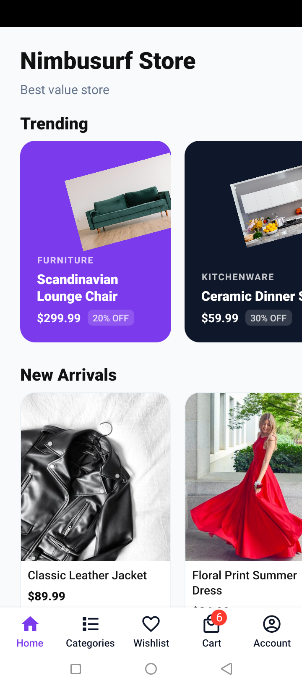
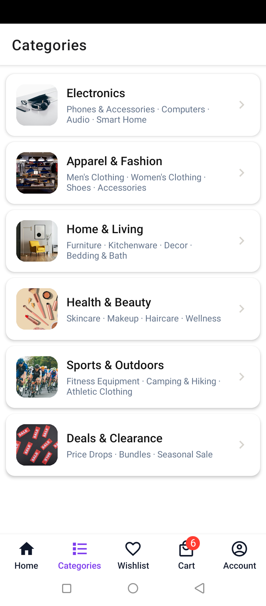
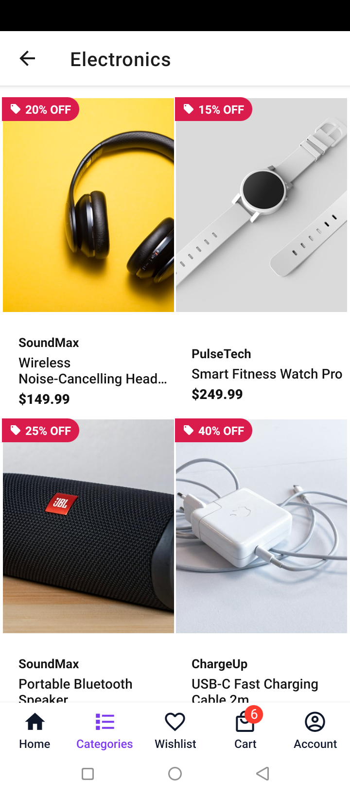

# Nimbusurf Mobi Store

A clean, modern e-commerce mobile app built with React Native and Expo. Browse products, manage your cart and wishlist, and complete checkout in a simple, intuitive interface.

<p align="center">
  
  &nbsp;&nbsp;&nbsp;&nbsp;&nbsp;&nbsp;
  
  &nbsp;&nbsp;&nbsp;&nbsp;&nbsp;&nbsp;
  
</p>

---

## About

Nimbusurf Mobi Store is a shopping app that demonstrates a full e-commerce flow: product browsing, category filtering, cart management, wishlist, address selection, and checkout.

---

## Features

- **Home** - Trending products, new arrivals, and recently viewed items.
- **Categories** - Browse Electronics, Apparel & Fashion, Home & Living, Health & Beauty, Sports & Outdoors, and Deals & Clearance.
- **Product Listing** - Two-column grid with offer badges and brand names.
- **Product Detail** - Full product view with Add to Bag and Wishlist toggle.
- **Cart** - Add, remove, increase/decrease quantities, and view a full price breakdown with discounts.
- **Wishlist** - Save favorite products and remove them with a tap.
- **Checkout** - Choose a delivery address and payment method (Card, UPI, or Cash on Delivery).
- **Authentication** - Phone number login with OTP. Includes a mock mode for demos and Firebase for production.
- **Address Book** - Add and manage multiple delivery addresses with a default selection.
- **Persistence** - Cart, wishlist, addresses, and auth sessions are saved locally and survive app restarts.

---

## Tech Stack

| Layer | Technology |
|-------|------------|
| Framework | React Native + Expo |
| Language | TypeScript |
| Navigation | React Navigation (Bottom Tabs + Native Stack) |
| State Management | Zustand with persist middleware |
| Storage | AsyncStorage + expo-secure-store |
| Icons | @expo/vector-icons |
| Auth (optional) | @react-native-firebase/auth |

---

## Getting Started

### Prerequisites

- Node.js 22 or higher (see `.nvmrc`)
- npm or yarn
- Expo Go app on your phone, or an Android / iOS emulator

### Installation

```bash
# 1. Clone the repository
git clone https://github.com/your-username/nimbusurf-mobistore.git
cd nimbusurf-mobistore

# 2. Install dependencies
npm install

# 3. Start the development server
npx expo start
```

Scan the QR code with the Expo Go app, or press `a` for Android or `i` for iOS to open an emulator.

> If images do not appear after adding assets, restart Metro with a clean cache:
>
> ```bash
> npx expo start -c
> ```

---

## Configuration

Copy `.env.example` to `.env` and update the values as needed.

```env
EXPO_PUBLIC_ENV=development
EXPO_PUBLIC_APP_NAME=Nimbusurf Mobi Store

# API endpoints (optional - app works with local sample data)
EXPO_PUBLIC_API_CLOTHES_URL=
EXPO_PUBLIC_API_AVAILABLE_CLOTHES_URL=

# Phone / OTP configuration
EXPO_PUBLIC_DEFAULT_DIAL_CODE=+263
# EXPO_PUBLIC_PHONE_LENGTH=9

# Auth provider: "mock" (default, works in Expo Go) or "firebase" (dev build)
EXPO_PUBLIC_AUTH_PROVIDER=mock

# Firebase (only needed when EXPO_PUBLIC_AUTH_PROVIDER=firebase)
EXPO_PUBLIC_FIREBASE_API_KEY=
EXPO_PUBLIC_FIREBASE_AUTH_DOMAIN=
EXPO_PUBLIC_FIREBASE_PROJECT_ID=
```

### Authentication Modes

| Mode | When to use | OTP behavior |
|------|-------------|--------------|
| `mock` | Development and Expo Go | Any 6-digit OTP works |
| `firebase` | Production / Dev Build | Real SMS OTP via Firebase Auth |

The default dial code and expected phone length are configurable. The app auto-detects the phone length based on the dial code, but you can override it with `EXPO_PUBLIC_PHONE_LENGTH`.


---

## Available Scripts

| Command | Description |
|---------|-------------|
| `npm start` | Start the Expo dev server |
| `npm run android` | Build and run on Android |
| `npm run ios` | Build and run on iOS |
| `npm run web` | Start the web version |
| `npm run lint` | Run the Expo linter |
| `npm run typecheck` | Run TypeScript type checking |
| `npm run doctor` | Run expo-doctor diagnostics |
| `npm run fix:versions` | Fix dependency version mismatches |

---

## Data Persistence

All user data is stored locally on the device:

| Key | Storage | Contents |
|-----|---------|----------|
| `nimbusurf.cart` | AsyncStorage | Cart items |
| `nimbusurf.wishlist` | AsyncStorage | Wishlist items |
| `nimbusurf.addresses` | AsyncStorage | Saved addresses |
| `nimbusurf.orders` | AsyncStorage | Order history |
| `nimbusurf.auth.token` | SecureStore | Auth token |
| `nimbusurf.auth.user` | SecureStore | User profile |

---

## Screenshots

Screenshots are stored in the `screenshots` folder:

- `screenshot-1.png`
- `screenshot-2.png`
- `screenshot-3.png`

---

## Contributing

Contributions are welcome. Feel free to open an issue or submit a pull request.

1. Fork the repository.
2. Create a feature branch.
3. Commit your changes.
4. Push to the branch.
5. Open a Pull Request.

---

## License

This project is open source and available under the MIT License.